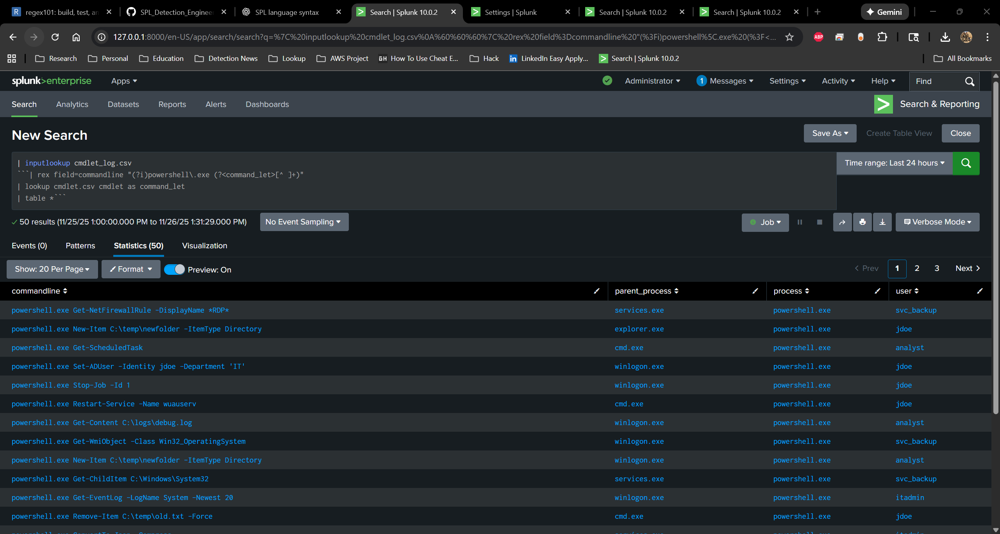
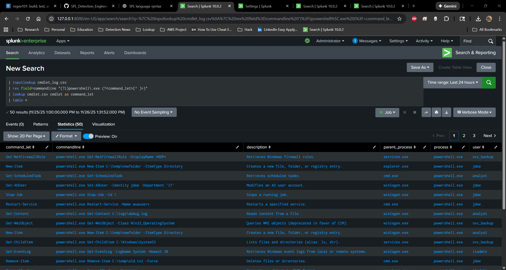
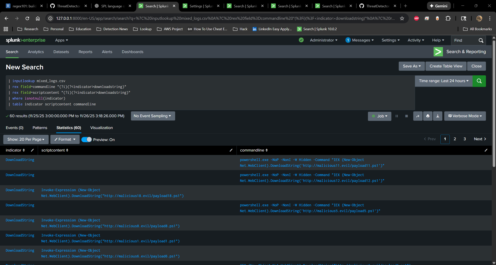
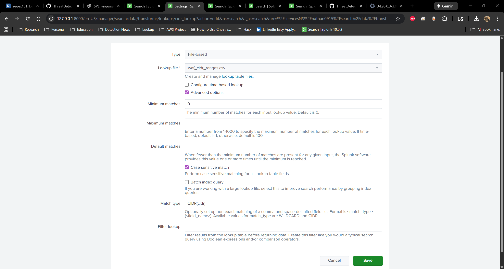
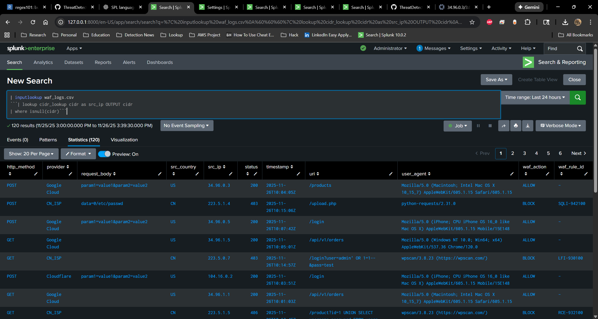
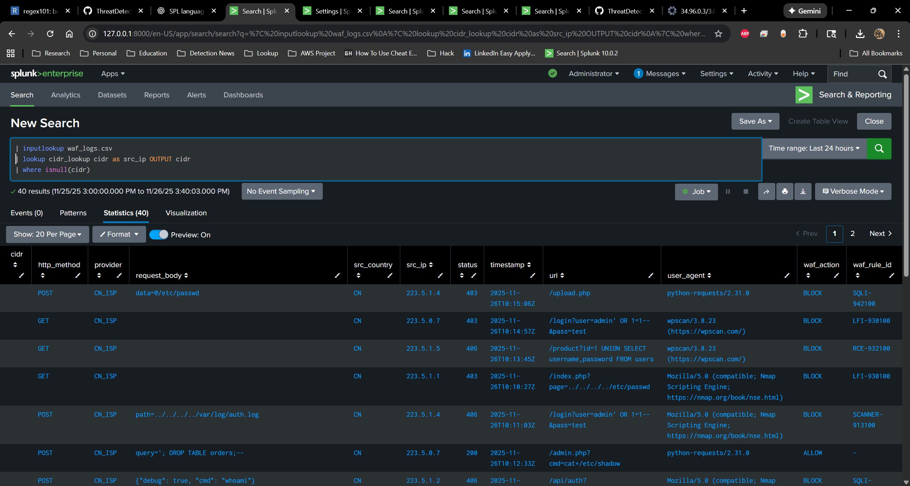
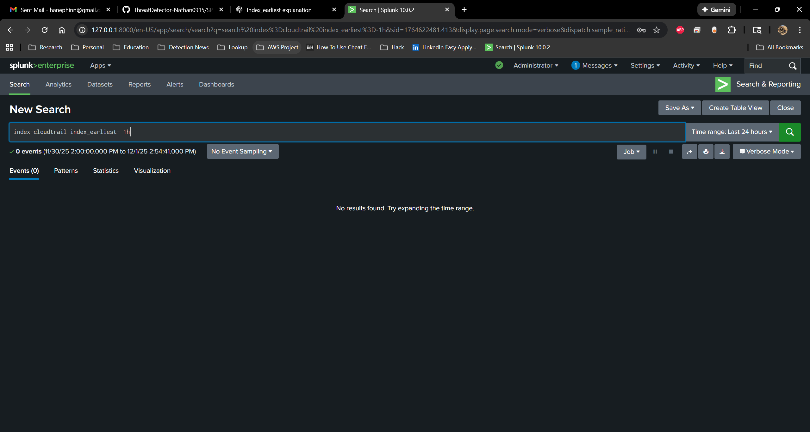
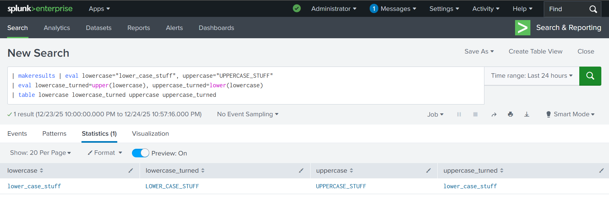
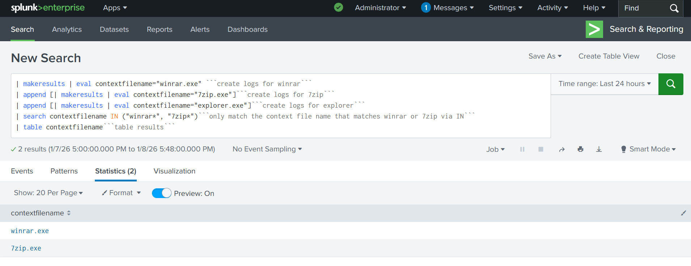
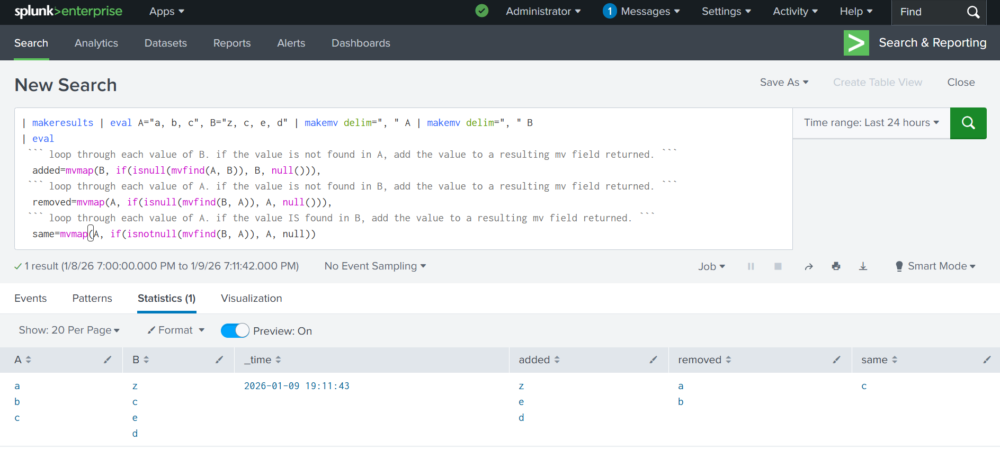

# TL;DR Summary
This repository contains a structured summary of my personal knowledge and experience in Splunk detection logic. It includes generic Splunk SPL examples, regex demonstrations, and detection engineering techniques intended for education, skill development, and community knowledge-sharing. All examples are platform-agnostic and do not reference any internal, confidential, or proprietary data from past employers.

A small set of test logs is included in the `/logs` folder for users who want to practice SPL searches and validate techniques in a safe environment. These logs were artificially generated and contain no real-world or customer data.

The purpose of this repository is to demonstrate detection logic concepts, reinforce learning, and serve as a reference for both myself and others in the cybersecurity community.

---

## Legal & Ethical Disclaimer

All content in this repository represents my own personal thoughts, interpretations, and educational summaries related to Splunk SPL and general detection engineering concepts. This repository does **not** contain, reference, or replicate any proprietary information, internal detection logic, intellectual property, architecture, log data, or security techniques belonging to any past, present, or future employer.

All SPL examples, syntax explanations, and command references are derived from publicly available resources such as the official Splunk documentation.  
All sample logs and test data included in this repository were artificially generated through AI prompts and do not represent real systems, environments, or customer information.

This repository is intended strictly for educational, non-commercial, and community-driven knowledge sharing. Any resemblance to real environments is coincidental and unintentional.


*All screenshots shown were taken from a personal lab environment on my own laptop and do not represent any employer or real production systems.*

---

# rename
**Description:** Renaming a field will transform the field name into the defined name. This will transform the field’s name, unlike an eval of a field into a new field, which will leave the original and create a new one. This will rename the original, and for the rest of the search you will need to use the new name.

**Uses:** Say you have a query that is taking fields from multiple indexes, and in those fields there is the same value you are trying to correlate. However, the field names are different—example: user, UID, username, etc. You can use a rename to rename the fields so they can be correlated together. This is very helpful for field normalization.

Example Usage 1 rename:
```spl
| inputlookup gerneric_logs.csv ```pull in generic logs``` 
| rename commandline as blah ```just rename commandline as blah```
| table * ``` table all fields```
``` 

Example Usage 2 rename:
```spl
| inputlookup gerneric_logs.csv ```pull sample data```
| rename commandline as commands, dest_ip as destination_ip ```rename commandline as commands and dest_ip as destination_ip```
| table commands destination_ip ```table only those two fields```
```


---

# regex
**Description:** Defines a pattern that should match a regular expression. Regular expression is very powerful and can be used to precisely match patterns that otherwise would be impossible to express in regular Splunk search terms.

**Uses:** Let’s say I am looking for a malicious command line where the threat actor is employing obfuscation. In a normal Splunk search, you can define a field=x, field=*x*, or you can search just for x (via token). But let’s say x appears with y, and there are extra characters sprinkled in that break the token for Splunk. Also, putting wildcards between tokens in Splunk results in terrible search performance—example: field=*x*y. This will also return inconsistent results. Never fear, regex is here :)

Example Usage (this will search for string 1 and 2 sequentially regex is a massive area that I will break down in a different guide):
```spl
| inputlookup gerneric_logs.csv ```pull in generic logs```
| regex commandline="(?is)cmd.*whoami" ```regex a field for string1 followed by string2```
| table commandline ```only table out commandline```
```


---

# rex
**Description:** The rex is one of my all-time personal favorites. You can use it to extract a value from a field into a new field—or several new fields. This can be very useful if, for instance, you are creating a detection and the regex match has potential to be in multiple fields. With a standard regex, you can only match on one field, but with rex you can extract multiple values into a single field and filter off that one field, working around the regex limitation. Rex is also field-aware, so if a field has multiple values you would like to become fields of their own, you can write the regex to account for that.

**Uses:**
Example (Usage matching on multple fields returning only positive hits):
```spl
| inputlookup mixed_logs.csv
| rex field=commandline "(?i)(?<indicator>downloadstring)" ```extracted bad indicator out of commandline, by matching pattern```
| rex field=scriptcontent "(?i)(?<indicator>downloadstring)"```extracted bad indicator out of scriptcontent, by matching pattern```
| where isnotnull(indicator) ```return only results where indidcator had value```
```


Example 2 (Using one rex to extract multple fields from a single string)
```spl
| inputlookup mixed_logs.csv ```pull in sample logs```
| rex field=commandline "(?i)(?<executable>^[^ ]+).*\/(?<payload>.+\..{3})" ```extracted the executable and the payload out of the commandline field```
| regex commandline="(?is)downloadstring" ```regex match on commandline logs that had downloadstring```
| head 5 ```only return first 5 events```
| table commandline executable payload ```table out only commandline and two created fields```
```


---

# rex mode=sed
**Description:** `rex mode=sed` is also very powerful and can be used to transform field results by replacing, altering, or removing characters. Unlike a normal `rex` extraction, which creates new fields, `mode=sed` modifies the existing field in place. This makes it extremely useful for cleanup, normalization, and preparing fields for correlation.

**Uses:** Let’s say you have a field you are trying to correlate with another field from a different index. The values are *almost* identical, but there is inconsistent or odd formatting mixed in—extra brackets, prefixes, suffixes, hidden characters, or delimiter differences. These small inconsistencies can completely break joins, lookups, or correlation logic. Using `rex mode=sed`, you can rewrite the field by removing or standardizing the problematic characters so the two values match cleanly.

See the user example below.
**Example Usage:**
```spl
| makeresults | eval user_email="john.borman@greatcompany.com", login_location="badplace" ```create logs for a user_email and login locations```
| append [|makeresults | eval user_name="john.borman", login_time="tuesday"] ``` create more logs for a username log with a login time```
| rex mode=sed field=user_email "s/@.+//g" ```replaced everything from the @ sign in an email to after that with no value```
| eval user=coalesce(user_email,user_name) ```combine the normalized fields into the user field```
| stats values(login_time) as login_time values(login_location) as login_location by user _time ```return the correlated values by correlated username and time```
```
Not normalized/uncorelated:

Normalized and Corelated


---

# where
**Description:** `where` is very useful for defining a condition that must evaluate as true for a result to be returned. Unlike basic search terms, which match raw text or field values, `where` evaluates logical expressions, comparisons, and calculations—giving you much more control over filtering.

**Uses:** `where` can be used in correlation search logic, post-aggregation filtering, numerical comparisons, and evaluating mathematical expressions. It allows you to write conditional logic such as thresholds, ratios, time differences, or multi-field comparisons that cannot be expressed through standard search syntax. See examples below.

**Example Usage:** (where certian field is equal to discrete value) 
```
spl
| inputlookup mixed_logs.csv ```pull test data```
| rex field=commandline "(?i)(?<executable>^[^ ]+).*\/(?<payload>.+\..{3})" extract the payload and the executable out of the commandline```
| regex commandline="(?is)downloadstring" ```regex match commandline for only a downloadstring```
| head 5 ```return only first 5 results```
| table commandline executable payload ``` table out commandline two extracted fields```
| where executable=="powershell.exe" AND payload=="payload5.ps1" ```logical expression where excutable and payload must be equal to exact values```
```


**Example Usage2:** (where math, distance is greater than 200 miles) 
```spl
| makeresults | eval user_email="john.borman@greatcompany.com", login_location="badplace", distance_from_work="230" ```create logs for a user 230 miles from work```
| append [|makeresults | eval user_name="john.borman", login_time="tuesday",  distance_from_work="60"] ``` create another log for a user only 60 miles from work```
| where distance_from_work>200 ```logical expression saying that the distance_from_work field must have avalue greater than 200 to return results```
```

**Example Usage2:** (where, logical expression) 
```spl
| makeresults | eval user_email="john.borman@greatcompany.com", login_location="badplace", distance_from_work="230" create a log without a login_time value```
| append [|makeresults | eval user_name="john.borman", login_time="tuesday",  distance_from_work="60"] ```create a log with a a login_time value```
| where isnotnull(login_time) ```logical expression saying that the login_time field must contain a non null value```
```


---

# lookup
**Description:** `lookup` is a powerful command used to enrich events with additional context pulled from external data sources. It allows threat detection teams to attach metadata—such as user roles, asset owners, threat intelligence indicators, and standardized field mappings—to raw log data. It can also perform CIDR-based matching and ASN enrichment, which will be covered in a separate section. In short, `lookup` enhances the quality and completeness of event data by joining it with structured reference information.

**Uses:** `lookup` can be used to correlate fields across different indexes, normalize inconsistent field names, add enrichment values from assets or identity stores, or map raw values to standardized categories. It is commonly used to match IP addresses to CIDR ranges, map usernames to departments, attach threat intelligence to IPs or domains, or supplement detection logic with static reference tables. This enables stronger correlation logic, better context, and more accurate detection outcomes.

**Example Usage:**
```spl
| inputlookup cmdlet_log.csv ```get test logs```
| rex field=commandline "(?i)powershell\.exe (?<command_let>[^ ]+)" ```extract cmdlet from the logs```
| lookup cmdlet.csv cmdlet as command_let ```lookup that cmdlet against a list with cmdlet/description```
| table * ```table all results```
```
cmdlet's not enriched

cmdlet's enriched


---

# isnull/isnotnull
**Description:** `isnull` and `isnotnull` are used to check whether a field contains a value or is empty. They are commonly used within `where` clauses to add logical filtering that standard search syntax cannot express. While you *can* check for non-null values using a basic search filter like `| search field=*`, the `isnull` and `isnotnull` functions provide more precise control when building conditional logic, especially after field extractions or aggregations.

**Uses:** These functions are extremely helpful when you only want results where a particular extracted field is present—or where it is missing. For example, if you extract indicators from scriptcontent or commandline fields, you may only want events where the extraction succeeded (`isnotnull`). Conversely, there are times when you want to return only events where no match occurred. A common case is CIDR/lookup filtering: if you compare an IP address against a list or subnet and no match is found, `isnull` lets you return only the values that fall *outside* the expected ranges. This is especially useful in negative-matching detections, enrichment lookups, and correlation logic.
 
**Example Usage: isnotnull script/command**
```spl
| inputlookup mixed_logs.csv ```pull test logs```
| rex field=commandline "(?i)(?<indicator>downloadstring)" ```extracted bad indicator out of commandline, by matching pattern```
| rex field=scriptcontent "(?i)(?<indicator>downloadstring)"```extracted bad indicator out of scriptcontent, by matching pattern```
| where isnotnull(indicator) ```return only results where indidcator had value```
| table indicator scriptcontent commandline ```table out the indocator that had value with the two parsed fields```
```


**Example Usage: isnull cidr negation**
```spl
| inputlookup waf_logs.csv ```pull waf logs```
| lookup cidr_lookup cidr as src_ip OUTPUT cidr ```match IPs against negation ranges```
| where isnull(cidr) ```negate results that matched a range of approved ISPs```
```
Note CIDR Negations require a lookup definition in Splunk Example:

Results without Negations for Google/CloudFlare ranges:

Results with negation, only malicous traffic remains


---

# index_earliest
**Description:** index_earliest is different from a normal time filter like earliest=-7d because it doesn’t look at the event’s _time value at all. Instead, it filters events based on when they were actually written into the index using _indextime. This matters when logs arrive late or out of order. For example, if there’s a logging outage and seven days of old data suddenly floods into Splunk over a few hours, using index_earliest=-1h tells Splunk to only return events that physically hit the index within the last hour, regardless of their timestamp. It’s basically a guardrail against backfilled data so your searches don’t get polluted by stale events.

**Uses:** The main use cases revolve around keeping your searches, dashboards, and detections focused on fresh data. It’s helpful when you want to ignore delayed or backfilled logs, stabilize analytics when an ingestion pipeline catches up, and prevent alert fatigue during reconnect storms from agents or batch-delivery systems. It keeps detections clean by ensuring they only evaluate events that have been indexed recently, which is critical for real-time monitoring environments like EDR, CloudTrail, WAF logs, syslog aggregators, and anything prone to ingestion delays.

**Example Usage:**
```spl
index=cloudtrail index_earliest=-1h
```


---

# dc
**Description:** The distinct count command `dc()` is a powerful stats function in Splunk that helps with search logic by deduplicating values inside a field and returning how many unique items exist. Instead of counting every occurrence, it strips out repeats and gives you a clean uniqueness count. This is especially useful in behavioral detection work where you want to understand the variety of actions taken, not just the total volume.

**Uses:** Its use cases are broad, but a common example is detecting suspicious enumeration or discovery behavior. On their own, commands like checking account permissions, running whoami, using net.exe to enumerate AD groups, or performing a quick ICMP sweep aren’t individually alarming. However, when all of these occur together within a short window, they form a behavioral cluster that can indicate an adversary probing the environment. By using dc(commandline), you can quickly identify how many unique commands were executed, helping you distinguish between normal noise and a potentially meaningful sequence of discovery actions.

**Example Usage:**
```spl
| inputlookup cmdlet_log.csv ```get commandline logs```
| stats values(commandline) as commandline dc(commandline) as command_count by user ```perform dc by user and command, also list off the commands via values```
| sort - command_count ```sort the results by the count of commands, highest first```
```


---

# stats
**Description:** stats is one of the core transforming commands in Splunk and is used to aggregate, summarize, and analyze data across events. Instead of returning raw logs, it reshapes the dataset by computing values like counts, sums, averages, distinct counts, or custom calculations. It essentially lets you collapse thousands of events into meaningful metrics or groupings that are easier to interpret and act on. Because it restructures the data, stats becomes the backbone for dashboards, correlation searches, and most behavioral detections.

**Uses:** Its uses are extremely broad—anything from counting authentication attempts, grouping by IP addresses or users, calculating average response times, identifying unique process executions, or summarizing network traffic patterns. In detection engineering, stats is typically used to cluster related activity together, look for patterns that only emerge when events are viewed as a whole, or surface anomalies such as unusually high volumes of actions by a user or host. It’s also useful for cleaning up noisy results by reducing multiple related events into a single analytic record.

**Example Usage:**
```spl
| inputlookup cmdlet_log.csv ```get commandline logs```
| stats values(commandline) as commandline dc(commandline) as command_count by user ```perform dc by user and command, also list off the commands via values```
| sort - command_count ```sort the results by the count of commands, highest first```
```


---

# values
**Description:** values() is a Splunk stats/transforming command function that returns a deduplicated list of all distinct values for a given field within the result set. This is useful when you want to collapse many events into a single row but keep the unique occurrences for reference. Unlike list(), which returns all values (including duplicates), values() ensures each value appears only once.
**Uses:** The values() function is most useful when you need to summarize a dataset by showing only the distinct occurrences of a field without repeating duplicates. It helps reduce noise in large result sets by collapsing repeated values into a clean, deduplicated list—ideal for reviewing unique users, hosts, commands, IPs, or processes involved in an event sequence. This is especially valuable in detection engineering and dashboarding, where you want to quickly see what different things happened rather than how many times they occurred. Because it returns only unique values, values() also helps validate whether multiple variations of a field were present (e.g., different command lines or authentication types), making it a powerful tool for summarization, correlation, and reporting.
**Example Usage:**
```spl
| inputlookup cmdlet_log.csv ```get commandline logs```
| stats values(commandline) as commandline dc(commandline) as command_count by user ```perform dc by user and command, also list off the commands via values```
| sort - command_count ```sort the results by the count of commands, highest first```
```


---

# bin
**Description:** bin is used to bucket numeric or time-based fields into fixed-size intervals. Instead of working with raw timestamps or continuous numeric values, bin rounds values down into consistent buckets so events can be grouped and analyzed together. It is most commonly used with time (_time) but can also be applied to other numeric fields like distances, counts, durations, or sizes.

**Uses:** bin is extremely useful when you want to analyze behavior over consistent time windows or ranges rather than individual events. In detection engineering, this is commonly used to group activity into time slices for rate-based detections, burst analysis, or behavioral clustering. For example, you might bin authentication events into 5-minute windows to look for spikes, or bin distances to detect anomalous travel patterns. Without binning, stats and thresholds can be noisy and hard to interpret.

**Example Usage:** 
```spl
| inputlookup auth_logs.csv ```pull authentication logs```
| bin _time span=5m ```bucket events into 5 minute intervals```
| stats count as auth_attempts by user _time ```count auth attempts per user per time bucket```
| where auth_attempts > 10 ```return users with more than 10 attempts in 5 minutes```
```
**Example Usage 2: (binning numeric values)**
```spl
| inputlookup login_distance.csv ```pull login distance logs```
| bin distance_from_work span=50 ```bucket distance into 50 mile ranges```
| stats count by distance_from_work ```count events per distance bucket```
```

---
# lower/upper
**Description:** upper() and lower() are string-manipulation functions used to normalize text by converting character case. upper() converts all alphabetical characters in a string to uppercase, while lower() converts them to lowercase. These functions are most often used during field normalization to ensure consistent comparisons, aggregations, and joins—especially when dealing with user input, process names, hostnames, usernames, or other fields where case variance can break logic.
**Uses:** These functions are critical when building reliable detections and analytics in environments where case sensitivity is inconsistent across data sources. For example, usernames may appear as Nathan, NATHAN, or nathan depending on the log source. Normalizing values with lower() (or upper()) ensures accurate matching in where clauses, lookups, and joins. They are also commonly used before deduplication, correlation searches, and when enforcing naming standards in dashboards and reports. In detection engineering, this prevents missed detections caused purely by casing differences rather than actual semantic differences in behavior.
**Example Usage:**
```spl
| makeresults | eval lowercase="lower_case_stuff", uppercase="UPPERCASE_STUFF"
| eval lowercase_turned=upper(lowercase), uppercase_turned=lower(lowercase)
| table lowercase lowercase_turned uppercase uppercase_turned
```

---
# IN
**Description:** In Splunk, the IN command allows you to specify multiple values for a single field, with or without wildcards. This is useful when you want to match several discrete values without writing a regular expression or chaining multiple logical conditions. In simple terms, it functions like saying “give me this or that” within a specific field.
**Uses:** You may want to identify two specific processes that can appear in the contextfilename field. In this case, we only care about WinRAR and 7-Zip, even though many other processes may be present. The following single-line SPL can be used to refine the results accordingly.
**Example Usage:**
```spl
| makeresults | eval contextfilename="winrar.exe" ```create logs for winrar```
| append [| makeresults | eval contextfilename="7zip.exe"]```create logs for 7zip```
| append [| makeresults | eval contextfilename="explorer.exe"]```create logs for explorer```
| search contextfilename IN ("winrar*", "7zip*")```only match the context file name that matches winrar or 7zip via IN```
| table contextfilename```table results```
```

---
# table
**Description:** The table command is a basic formatting command used to display only the fields you care about. You can also use table * to display all available fields. Tables are especially useful as foundational commands for joins, or on their own to present data in a format that analysts can easily read and understand.
**Uses:** The table command formats Splunk search results by selecting and ordering specific fields without altering the underlying data. It is used to reduce noise, improve readability, and present results in a structured, analyst-friendly format. Tables are commonly used to validate field extractions, standardize outputs for dashboards and reports, and prepare data for joins or correlation searches. In detection engineering, table acts as an infrastructure command that helps analysts quickly interpret results and ensures consistent, reliable data presentation across workflows.
**Example Usage:**
```spl
| makeresults | eval lowercase="lower_case_stuff", uppercase="UPPERCASE_STUFF"
| eval lowercase_turned=upper(lowercase), uppercase_turned=lower(lowercase)
| table lowercase lowercase_turned uppercase uppercase_turned
```

---
# coalesc
**Description:** Coalesce evaluates multiple fields and returns the first non-null value. It is commonly used to normalize data when the same information may appear in different fields across events.
**Uses:** In detection engineering, coalesce is used to normalize inconsistent telemetry by combining multiple possible fields (such as different username or host fields) into a single standardized field, ensuring detections work reliably across diverse log sources. It also helps reduce missed detections by preventing null or missing fields from breaking detection logic, allowing alerts to trigger as long as the required data exists in any relevant field.
**Example Usage:**
```spl
| makeresults | eval win_user="Administrator", edr_user=null(), cloud_user="admin@corp.com" ```creates several identity values```
| eval normalized_user=coalesce(edr_user, win_user, cloud_user)``` fills normalized_user with the first non-null value```
| table win_user edr_user cloud_user normalized_user ``` table results to show what happened```
```

---
# mvmap
**Description:** In Splunk, mvmap lets you iterate over each value in a multivalue field and apply an expression to it, which makes it ideal for comparing two multivalue fields without needing expensive mvexpand loops. You can use mvmap together with functions like mvfind() to test whether a value from one field exists in another, effectively letting you find values that were added, values that were removed, or values that overlap between the two lists. For example, you can build lists of values unique to one multivalue field or common to both by checking for matches on each element.
**Uses:** In detection engineering, mvmap can be used to compare multivalue fields to identify suspicious patterns such as phishing campaigns where a downloaded file name matches the sender’s domain, or cases where newly added permissions or group memberships differ from a user’s previous access list. This allows analysts to quickly spot abnormal overlaps or changes across multiple values without expanding events, making it easier to detect credential abuse, malware delivery, or unauthorized access changes.
**Example Usage:**
```spl
| makeresults | eval A="a, b, c", B="z, c, e, d" | makemv delim=", " A | makemv delim=", " B
| eval
 ``` loop through each value of B. if the value is not found in A, add the value to a resulting mv field returned. ``` 
  added=mvmap(B, if(isnull(mvfind(A, B)), B, null())),
 ``` loop through each value of A. if the value is not found in B, add the value to a resulting mv field returned. ``` 
  removed=mvmap(A, if(isnull(mvfind(B, A)), A, null())),
 ``` loop through each value of A. if the value IS found in B, add the value to a resulting mv field returned. ``` 
  same=mvmap(A, if(isnotnull(mvfind(B, A)), A, null))
  ```
  *Extra Reference:*https://community.splunk.com/t5/Splunk-Search/Comparing-Multivalue-Fields/m-p/551128
  
---
# makemv
**Description:**
**Uses:**
**Example Usage:**
---
# map
**Description:**
**Uses:**
**Example Usage:**
---
# TERM
**Description:**
**Uses:**
**Example Usage:**
---
# head/tail
**Description:**
**Uses:**
**Example Usage:**
---
# rex mode=sed 
**Description:**
**Uses:**
**Example Usage:**
---
# transaction
**Description:**
**Uses:**
**Example Usage:**
---
# strftime
**Description:**
**Uses:**
**Example Usage:**
---
# join
**Description:**
**Uses:**
**Example Usage:**
---
# convert ctime
**Description:**
**Uses:**
**Example Usage:**
---
# fillnull
**Description:**
**Uses:**
**Example Usage:**
---
# strcat
**Description:**
**Uses:**
**Example Usage:**
---
# case
**Description:**
**Uses:**
**Example Usage:**
---
# if
**Description:**
**Uses:**
**Example Usage:**
---
# match vs like
**Description:**
**Uses:**
**Example Usage:**
---
# hex decode
**Description:**
**Uses:**
**Example Usage:**
---
# append info to lookup
**Description:**
**Uses:**
**Example Usage:**
---
# collect
**Description:**
**Uses:**
**Example Usage:**
---
# append (subsearch)
**Description:**
**Uses:**
**Example Usage:**
---
# iplocation
**Description:**
**Uses:**
**Example Usage:**
---
# fieldsummary
**Description:**
**Uses:**
**Example Usage:**
---
# metadata
**Description:**
**Uses:**
**Example Usage:**
---
