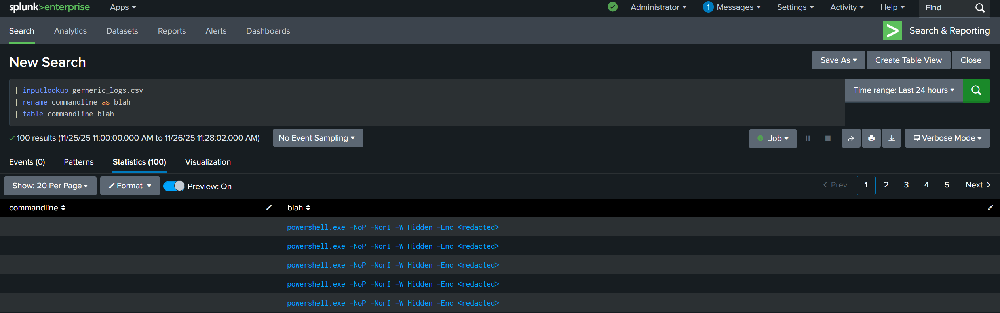
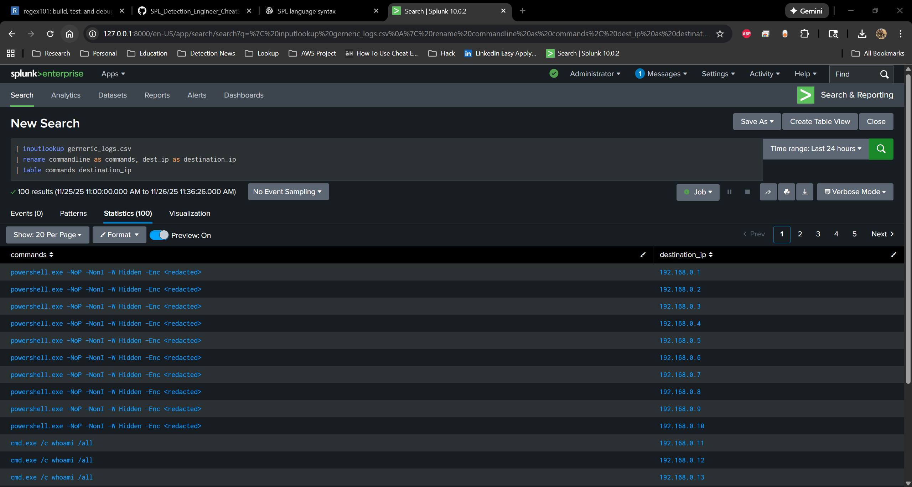
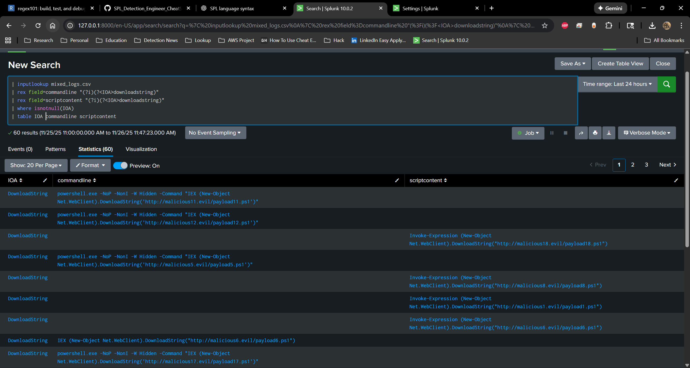
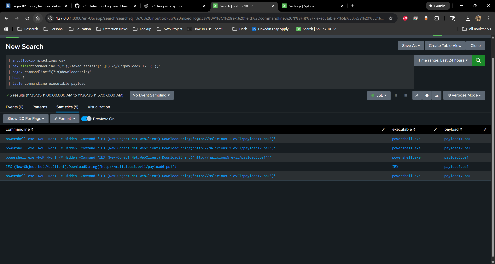
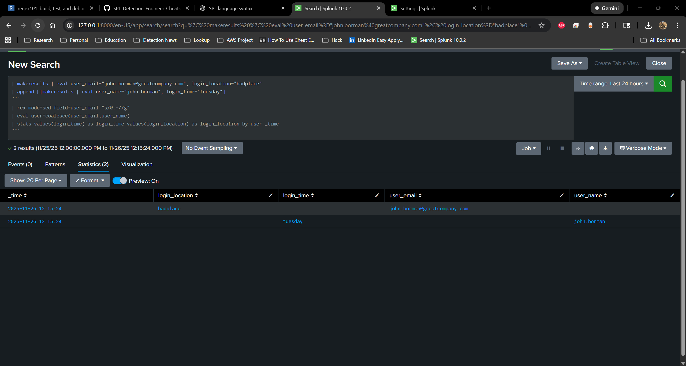
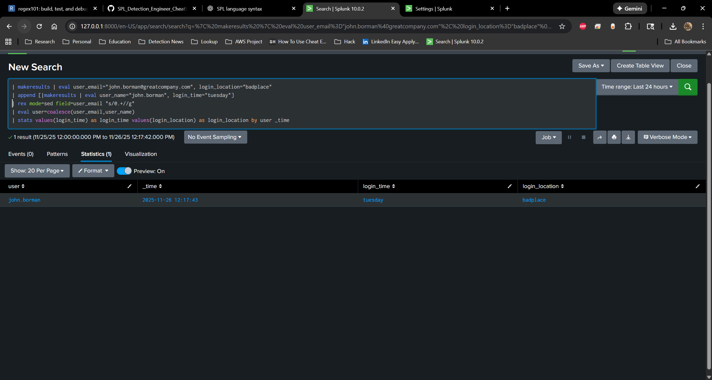
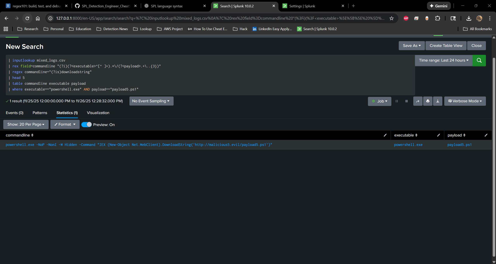
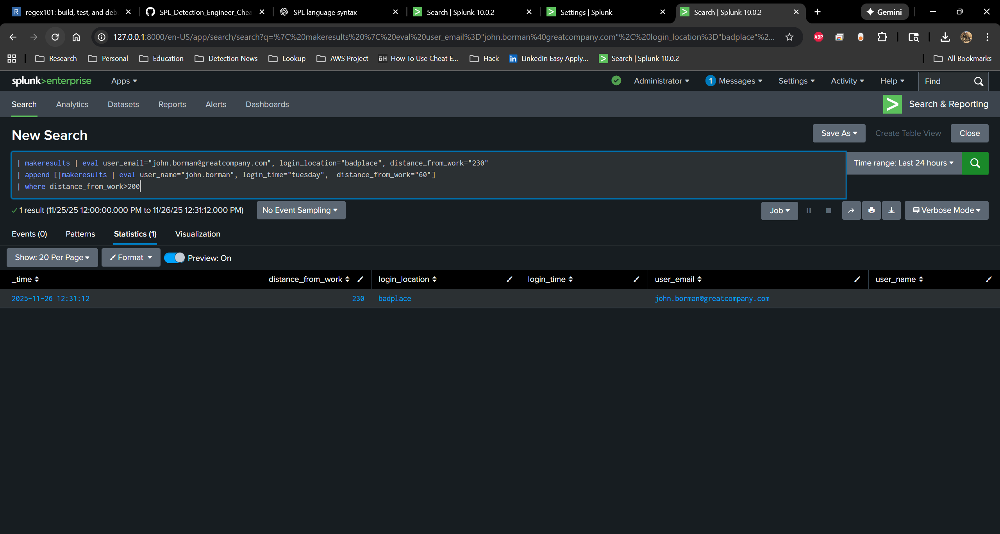

# rename
**Description:** Renaming a field will transform the field name into the defined name. This will transform the field’s name, unlike an eval of a field into a new field, which will leave the original and create a new one. This will rename the original, and for the rest of the search you will need to use the new name.

**Uses:** Say you have a query that is taking fields from multiple indexes, and in those fields there is the same value you are trying to correlate. However, the field names are different—example: user, UID, username, etc. You can use a rename to rename the fields so they can be correlated together. This is very helpful for field normalization.

Example Usage 1 rename:
```spl
(greater splunk search)
| rename user as UID
```

Example Usage 2 rename:
```spl
(greater splunk search)
| rename user as UID, username as UID
```


---
# regex
**Description:** Defines a pattern that should match a regular expression. Regular expression is very powerful and can be used to precisely match patterns that otherwise would be impossible to express in regular Splunk search terms.

**Uses:** Let’s say I am looking for a malicious command line where the threat actor is employing obfuscation. In a normal Splunk search, you can define a field=x, field=*x*, or you can search just for x (via token). But let’s say x appears with y, and there are extra characters sprinkled in that break the token for Splunk. Also, putting wildcards between tokens in Splunk results in terrible search performance—example: field=*x*y. This will also return inconsistent results. Never fear, regex is here :)

Example Usage (this will search for string 1 and 2 sequentially regex is a massive area that I will break down in a different guide):
```spl
(greater splunk search)
| regex field="(?is)string1.*string2"
```

---
# rex
**Description:** The rex is one of my all-time personal favorites. You can use it to extract a value from a field into a new field—or several new fields. This can be very useful if, for instance, you are creating a detection and the regex match has potential to be in multiple fields. With a standard regex, you can only match on one field, but with rex you can extract multiple values into a single field and filter off that one field, working around the regex limitation. Rex is also field-aware, so if a field has multiple values you would like to become fields of their own, you can write the regex to account for that.

**Uses:**
Example (Usage matching on multple fields returning only positive hits):
```spl
(greater splunk search)
| rex field=commandline "(?<IOAs>bad_pattern1.*badpattern2)"
| rex field=commandhistory "(?<IOAs>bad_pattern1.*badpattern2)"
| rex field=scriptcontent "(?<IOAs>bad_pattern1.*badpattern2)"
| where isnotnull(IOAs)
```


Example 2 (Using one rex to extract multple fields from a single string)
```spl
| rex field=commandline "(?i)(?<executable>^[^ ]+).*\/(?<payload>.+\..{3})"
```



---
# rex mode=sed
**Description:** `rex mode=sed` is also very powerful and can be used to transform field results by replacing, altering, or removing characters. Unlike a normal `rex` extraction, which creates new fields, `mode=sed` modifies the existing field in place. This makes it extremely useful for cleanup, normalization, and preparing fields for correlation.

**Uses:** Let’s say you have a field you are trying to correlate with another field from a different index. The values are *almost* identical, but there is inconsistent or odd formatting mixed in—extra brackets, prefixes, suffixes, hidden characters, or delimiter differences. These small inconsistencies can completely break joins, lookups, or correlation logic. Using `rex mode=sed`, you can rewrite the field by removing or standardizing the problematic characters so the two values match cleanly.

See the user example below.
**Example Usage:**
```spl
(great search)
| rex mode=sed field=user_email "s/@.+//g"
```



---
# where
**Description:** `where` is very useful for defining a condition that must evaluate as true for a result to be returned. Unlike basic search terms, which match raw text or field values, `where` evaluates logical expressions, comparisons, and calculations—giving you much more control over filtering.

**Uses:** `where` can be used in correlation search logic, post-aggregation filtering, numerical comparisons, and evaluating mathematical expressions. It allows you to write conditional logic such as thresholds, ratios, time differences, or multi-field comparisons that cannot be expressed through standard search syntax. See examples below.

**Example Usage:** (where certian field is equal to discrete value) 
```
spl
| where executable=="powershell.exe" AND payload=="payload5.ps1"
```


**Example Usage2:** (where math, distance is greater than 200 miles) 
```spl
| where distance_from_work>200
```

**Example Usage2:** (where math, logical expression) 
```spl
| where isnotnull(login_time)
```


---
# lookup
**Description:** `lookup` is a powerful command used to enrich events with additional context pulled from external data sources. It allows threat detection teams to attach metadata—such as user roles, asset owners, threat intelligence indicators, and standardized field mappings—to raw log data. It can also perform CIDR-based matching and ASN enrichment, which will be covered in a separate section. In short, `lookup` enhances the quality and completeness of event data by joining it with structured reference information.

**Uses:** `lookup` can be used to correlate fields across different indexes, normalize inconsistent field names, add enrichment values from assets or identity stores, or map raw values to standardized categories. It is commonly used to match IP addresses to CIDR ranges, map usernames to departments, attach threat intelligence to IPs or domains, or supplement detection logic with static reference tables. This enables stronger correlation logic, better context, and more accurate detection outcomes.


**Example Usage:**
---
# isnull/isnotnull
**Description:**
**Uses:**
**Example Usage:**
---
# index_earliest
**Description:**
**Uses:**
**Example Usage:**
---
# dc
**Description:**
**Uses:**
**Example Usage:**
---
# stats
**Description:**
**Uses:**
**Example Usage:**
---
# values
**Description:**
**Uses:**
**Example Usage:**
---
# bin
**Description:**
**Uses:**
**Example Usage:**
---
# lower/upper
**Description:**
**Uses:**
**Example Usage:**
---
# IN
**Description:**
**Uses:**
**Example Usage:**
---
# table
**Description:**
**Uses:**
**Example Usage:**
---
# coalesc
**Description:**
**Uses:**
**Example Usage:**
---
# mvmap
**Description:**
**Uses:**
**Example Usage:**
---
# makemv
**Description:**
**Uses:**
**Example Usage:**
---
# map
**Description:**
**Uses:**
**Example Usage:**
---
# TERM
**Description:**
**Uses:**
**Example Usage:**
---
# head/tail
**Description:**
**Uses:**
**Example Usage:**
---
# rex mode=sed 
**Description:**
**Uses:**
**Example Usage:**
---
# transaction
**Description:**
**Uses:**
**Example Usage:**
---
# strftime
**Description:**
**Uses:**
**Example Usage:**
---
# join
**Description:**
**Uses:**
**Example Usage:**
---
# convert ctime
**Description:**
**Uses:**
**Example Usage:**
---
# fillnull
**Description:**
**Uses:**
**Example Usage:**
---
# strcat
**Description:**
**Uses:**
**Example Usage:**
---
# case
**Description:**
**Uses:**
**Example Usage:**
---
# if
**Description:**
**Uses:**
**Example Usage:**
---
# match vs like
**Description:**
**Uses:**
**Example Usage:**
---
# hex decode
**Description:**
**Uses:**
**Example Usage:**
---
# append info to lookup
**Description:**
**Uses:**
**Example Usage:**
---
# collect
**Description:**
**Uses:**
**Example Usage:**
---
# append (subsearch)
**Description:**
**Uses:**
**Example Usage:**
---
# iplocation
**Description:**
**Uses:**
**Example Usage:**
---
# fieldsummary
**Description:**
**Uses:**
**Example Usage:**
---
# metadata
**Description:**
**Uses:**
**Example Usage:**
---